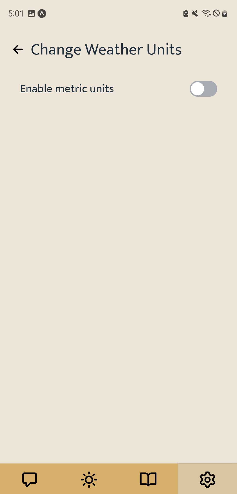
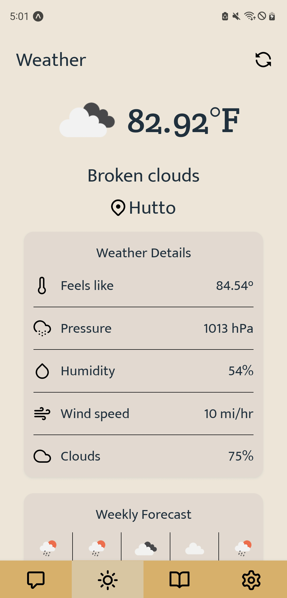
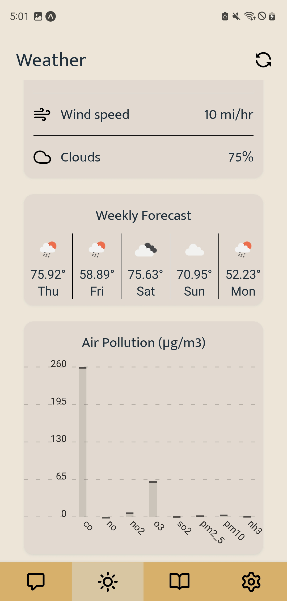

[![rabbit-logo]](https://github.com/awoelf/Rabbit)

## About

Rabbit is a mobile app that lets you chat with other users and catch up on news and weather.

### Features

- Create an account
- Message other users
- Create group chats
- View weather and news
- Update user credentials

### Built With

- [SendBird](https://sendbird.com/)
- [React Native](https://reactnative.dev/)
- [Apollo GraphQL](https://www.apollographql.com/)
- [MongoDB](https://www.mongodb.com/)
- [Heroku](https://www.heroku.com/home)

## Using the app

### Prerequisite

To use this app, you must have an Android device that can connect to the internet and enable location permissions.

### Step by step

1. Sign Up or Log In

&nbsp;

2. Create new channel

&nbsp;

&nbsp;

3. Send message and picture

&nbsp;

4. Channel Setting
   : Share channel link, setting notification, invite friends, leave channel

&nbsp;

&nbsp;

5. User Setting : Change profile avatar, change personal information, change unit setting for weather.

&nbsp;

&nbsp;

6. News : Get the recent top 20 stories or search news.

&nbsp;

7. Weather : Get local weather information. In the settings, you can change units to metric.

&nbsp;

## License

Distributed unter the MIT license. See `LICENSE.txt` for more information

## Contact

Yeon Seo
 

Alexis Woelffer
 

<!-- Images -->

[rabbit-logo]: ./assets/rabbit.svg

(<a href="#readme-top">back to top</a>)

