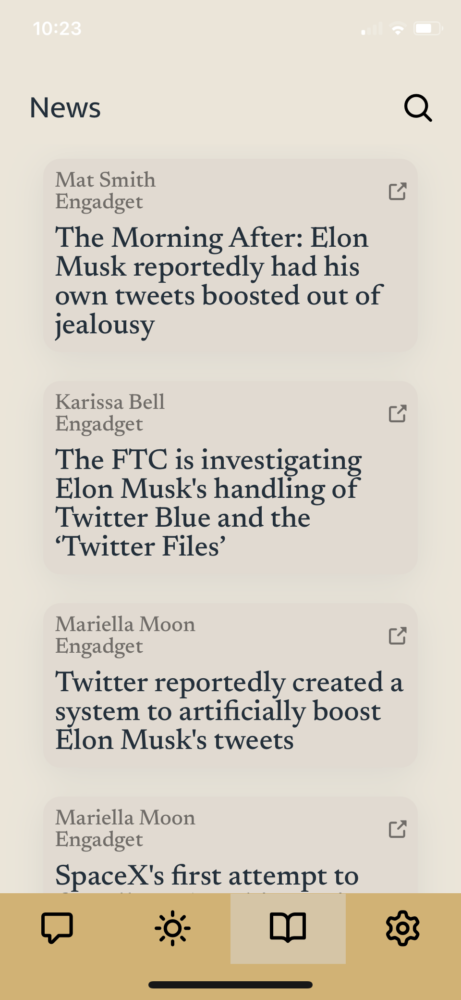

[![rabbit-logo]](https://github.com/awoelf/Rabbit)

## About

Rabbit is a mobile app that lets you chat with other users and catch up on news and weather.

### Features

- Create an account
- Message other users
- Create group chats
- View weather and news
- Update user credentials

### Built With

- [SendBird](https://sendbird.com/)
- [React Native](https://reactnative.dev/)
- [Apollo GraphQL](https://www.apollographql.com/)
- [MongoDB](https://www.mongodb.com/)
- [Heroku](https://www.heroku.com/home)

## Using the app

### Prerequisite

Coming soon

### Step by step
1. Sign Up or Log In

2. Create new channel

3. Send message and picture

4. Channel Setting 
: Share channel link, setting notification, invite friends, leave channel

5. User Setting : Change profile avatar, change personal information, change unit setting

6. News : Get the recent top 20 stories or search news.

7. Weather

<!-- 1. After starting the app, int your log in credentials or navigate to the sign up screen to create an account.
2. Once logged in, allow location services.
3.  -->

## License

Distributed unter the MIT license. See `LICENSE.txt` for more information

## Contact

Yeon Seo
 

Alexis Woelffer
 

<!-- Links and images -->

[rabbit-logo]: ./assets/rabbit.svg
[linkedin-svg]: ./assets/linkedin.svg
[email-svg]: ./assets/email.svg
[github-svg]: ./assets/github.svg

(<a href="#readme-top">back to top</a>)

